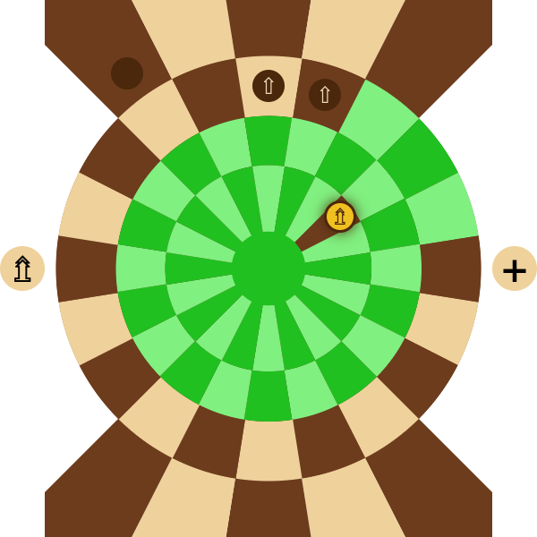

## Lautari

Lautari is a board game that combines simplicity of a design and ease of learning with strategic depth, offering players countless combinations and tactical opportunities. In this two-player game, opponents vie for control of a central area on the board by maneuvering their pieces and aiming to establish a winning formation. The ability to promote pieces and create a large variety of combinations adds layers of complexity and challenge. Success requires a balance of careful planning and timely execution, as every decision shapes the flow and outcome of the match. The game's complexity grows with the central cell's connection to all surrounding cells, enabling swift maneuvers and rapid formation changes. The victory conditions encourage thoughtful, deliberate strategies, rewarding players who rely on calculated combinations over reckless aggression.

---

### Build instructions

To build the project locally, run `yarn && yarn build` if you are using yarn, or `npm install && npm run build`. The project will be built into `dist` directory.

A working demo (playable locally, no multiplayer yet) can be found [here](https://ivanovsaleksejs.github.io/lautari/).

---

### How to play

In this game, two players face off in a strategic contest to control the center of the board. The game board consists of two starting positions (home area), each having three rows, five cells in each, and a center area where the most action occurs. The center area has one central cell surrounded by three circles, each containing 20 cells. The center area connected to the home areas with two additional rows.

Each player begins the game with 15 pieces, called Pawn, arranged in three rows of five pieces each. One player controls the white pieces, while the other controls the black pieces. A Pawn can move one step to any adjacent cell that shares a common edge with its current position. The center cell is uniquely connected to all cells within the inner circle.

 

If a piece moves to a cell occupied by an opponent's piece, that piece is captured and removed from the board. Any piece can capture any other piece. There are no forced takes, meaning that the player can choose not to capture a piece even if they have that option.

---

### Promotions

Pieces can be promoted to have a different role than the Pawn. Promotions can occur by reaching specific cells or by arranging pieces in specific formations.

If three pieces are placed in a straight line on adjacent cells connected by edges (either along the same row or within the same circle), the middle piece can be promoted to Infantry, provided it has not already been promoted and the middle cell is not in the home area. Note that diagonal placements do not qualify, as the cells must share edges to form a valid line. Additionally, the cells must form a continuous, straight alignment; configurations where cells are edge-connected but not in a straight line or an arc do not count. If the middle cell is the center cell of the board, the other two pieces must occupy cells that are directly opposite each other. The promotion takes one turn to complete, meaning that instead of moving any piece, player uses the turn to promote the piece. The Infantry piece is marked by a ⇧ symbol and can move up to 2 steps at a time. Movement may not be in one direction, for example, piece can make a step forward and a step left.

 

---

### Rider

If a piece reaches the Rider promotion cell (a circular cell on the left side of the center area, marked by a ⇯), it is promoted to a Rider automatically, without requiring a turn. The Rider piece is marked by a ⇯ symbol. This piece can move up to 3 steps and can jump over other pieces. Same as Infantry, Rider can make steps in different directions.

---

### Sentinel

If a piece reaches the Sentinel promotion cell (a circular cell on the right side of the center area, marked by a +), it is promoted to a Sentinel automatically, also without requiring a turn. The Sentinel piece is marked by a + symbol and can move one step.

---

### Sentinel feature

The Sentinel piece can revive a piece captured on the previous turn, provided the captured piece was adjacent to the Sentinel. This revival undoes the previous turn, restoring the captured piece and moving the opponent's piece back to its previous position. The revived piece cannot be captured on the next turn, and any promotion it held before capture is lost. Each player may only have one Sentinel piece at a time. If a Sentinel is captured, the player may promote another piece to become a Sentinel.

https://github.com/user-attachments/assets/f6eefc4e-6e49-4a94-9399-f8dc68b88fd2

---

### Main objective

The main objective of the game is to gain control of the center. This is accomplished by placing a promoted piece in the center and positioning any two pieces in opposite cells within the inner circle. This configuration must remain intact for one turn to secure victory. For the black player, victory happens as soon as the configuration is made, since the turn ends after blacks move. The whites, however, must ensure that the blacks cannot disrupt the configuration during their turn - after the whites move and form the winning configuration, the blacks have a chance to take any of three pieces during the current turn. If they do not, the game is won by the whites. This rule balances the slight speed advantage whites have at the start of the game.

If either of the two pieces in the inner circle is captured and then revived by a Sentinel, the victory counter does not reset. However, if any of these pieces is moved, captured, and not revived, the counter resets.

### Draw

A draw is declared automatically if a player has fewer than three pieces remaining, as they can no longer achieve victory. A draw can also be declared at any time if both players agree.