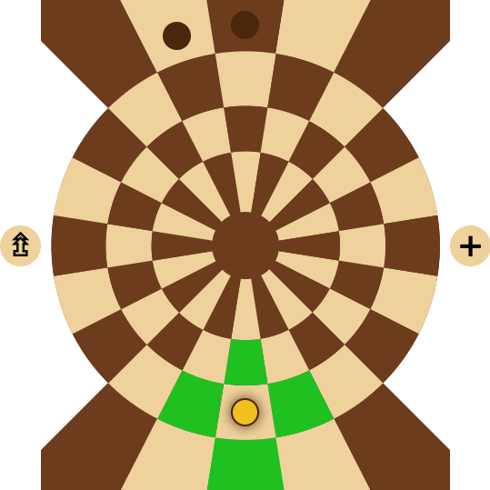
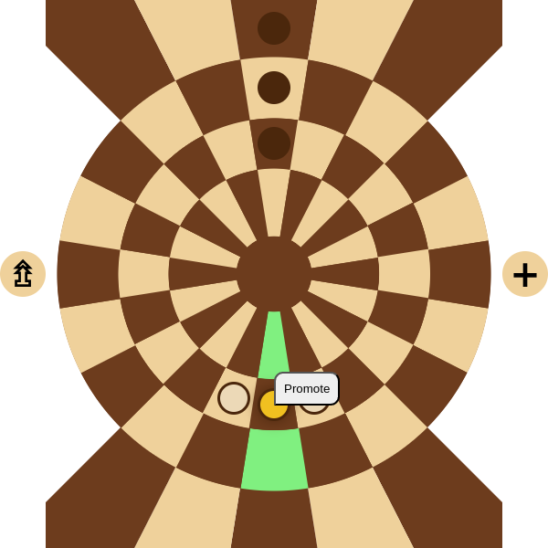
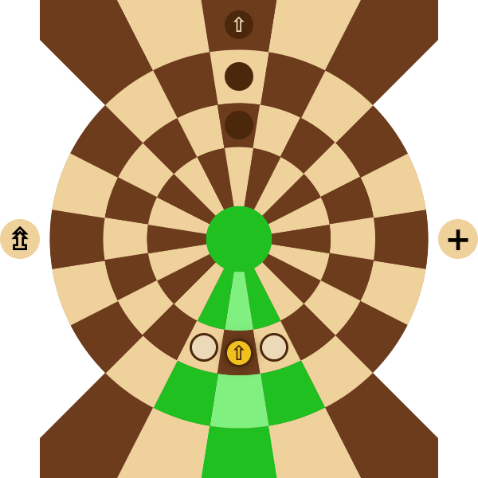
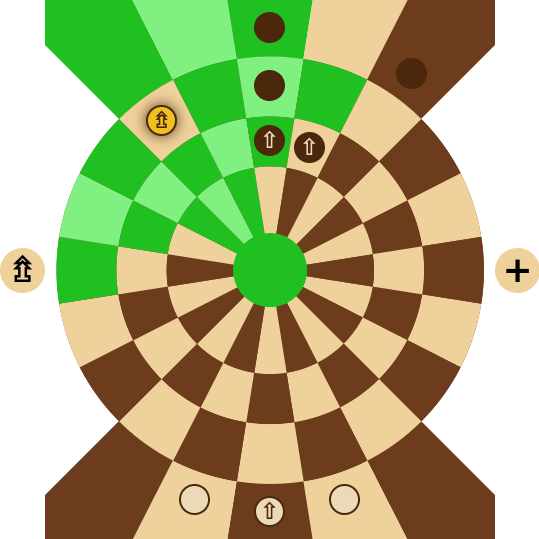
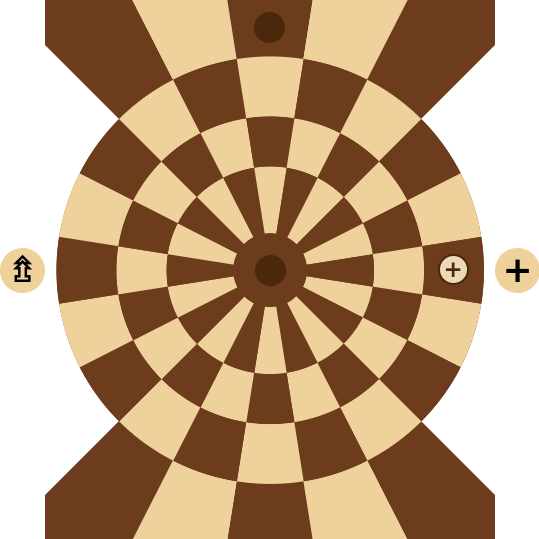
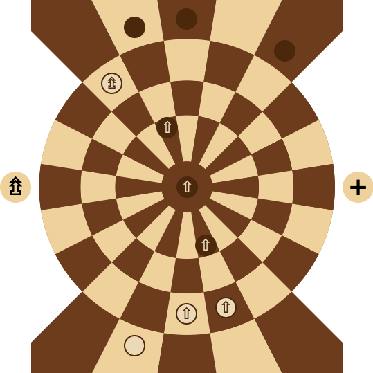

## Lautari

Lautari is a board game for control over a central area of a board, where two players compete by maneuvering pieces and attempting to secure a winning formation. Players can promote their pieces, adding complexity and tactical depth to dominate the board. The game requires both careful planning and timely moves, with each player's choices affecting the dynamic and outcome of the match.

To build the project locally, run `yarn && yarn build` if you are using yarn, or `npm install && npm run build`. The project will be built into `dist` directory.

A working demo (playable locally, no multiplayer yet) can be found [here](https://ivanovsaleksejs.github.io/lautari/).

---

## How to play

In this game, two players face off in a strategic contest to control the center of the board. The game board consists of two starting positions and a center area where the most action occurs. The center area has one central cell surrounded by three circles, each containing 20 cells.

Each player starts with 15 pieces called Pawn, arranged in three rows of five pieces each. Pieces can move one step to any cell adjacent to their current cell that shares a common edge. The center cell is adjacent to all cells of the inner circle.

If a piece moves to a cell occupied by an opponent's piece, that piece is captured and removed from the board.

---

### Promotions

Pieces can be promoted to have a different role than the Pawn. Promotions can occur by reaching specific cells or by arranging pieces in specific formations.

If three pieces are placed in a line on adjacent cells (either along the same line or within the same circle) and the middle piece of these three pieces has not been promoted and is not in the home area, it can be promoted to Horseman. The promotion takes one turn. The Horseman piece is marked by a ⇧ symbol. It can move up to 2 steps at a time.

 

---

### Ranger

If a piece reaches the Ranger promotion cell (a circular cell on the left side of the center area, marked by a ⇯), it is promoted to a Ranger automatically, without requiring a turn. The Ranger piece is marked by a ⇯ symbol. This piece can move up to 3 steps and can jump over other pieces.

---

### Sentinel

If a piece reaches the Sentinel promotion cell (a circular cell on the right side of the center area, marked by a +), it is promoted to a Sentinel automatically, also without requiring a turn. The Sentinel piece is marked by a + symbol and can move one step.

---

### Sentinel feature

The Sentinel piece can revive a piece captured on the previous turn, provided the captured piece was adjacent to the Sentinel. This revival undoes the previous turn, restoring the captured piece and moving the opponent's piece back to its previous position. The revived piece cannot be captured on the next turn, and any promotion it held before capture is lost. Each player may only have one Sentinel piece at a time. If a Sentinel is captured, the player may promote another piece to become a Sentinel.

https://github.com/user-attachments/assets/f6eefc4e-6e49-4a94-9399-f8dc68b88fd2

---

### Main objective

The main objective of the game is to gain control over the center. This is achieved by placing a promoted piece in the center and positioning any two pieces in two opposite cells within the inner circle. This configuration must be maintained for three consecutive turns to secure victory.

If either of the two pieces in the inner circle is captured and then revived by a Sentinel, the victory counter does not reset. However, if any of these pieces is moved, captured, and not revived, the counter resets.

### Draw

A draw is declared automatically if a player has fewer than four pieces remaining, as they can no longer achieve victory. A draw can also be declared at any time if both players agree.